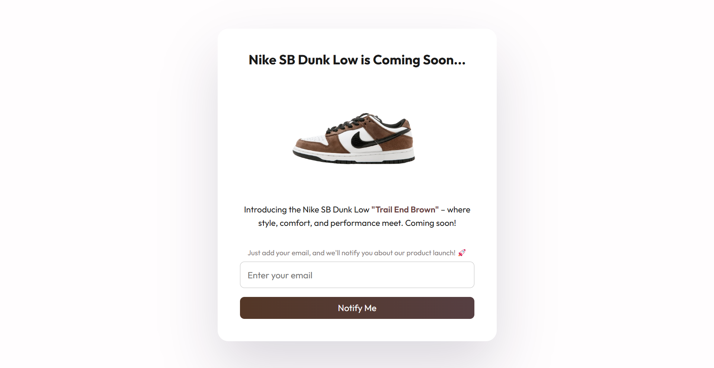

# Coming Soon Template

## Project Overview

### Description

A responsive "Coming Soon" page for the Nike SB Dunk Low with product highlights and email signup.

### Screenshots

### Technologies Used

- **Figma** – Used for initial design and layout planning.
- **HTML** – Structured the content, including the product name, image, and form.
- **CSS** – Styled the page with responsive design, shadows, gradients, and font customizations for a polished look.

### Learnings & Outcome

- Designed a responsive landing page to capture attention and encourage email signups.
- Enhanced skills in HTML and CSS for interactive and visually appealing designs.
- Improved understanding of responsive design for seamless performance across devices.

### Connect with Me

Stay connected and explore more of my work:

Thank you for exploring this project! Let’s build something amazing together. **Happy coding!** 🚀
